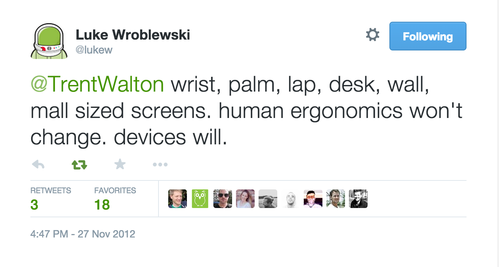

# ergonomic-breakpoint
[![NPM version][npm-image]][npm-url]
[![Downloads][downloads-image]][downloads-url]

Ergonomic CSS media queries. Uses
[`CSS custom media queries`](http://dev.w3.org/csswg/mediaqueries/#custom-mq).

[](https://twitter.com/lukew/status/273453112902172672)

## Installation
```bash
$ npm install ergonomic-breakpoint
```

## Usage
With [cssnext](https://github.com/cssnext/cssnext) or
[sheetify](https://github.com/sheetify/sheetify) installed:
```css
@media (--wrist) {
  /* styles for wrist viewport */
}
```

## API
### @media (--wrist)
Wrist viewport. `<320px`.

### @media (--palm)
Palm viewport. `>=320px && <800px`.

### @media (--lap)
Lap viewport. `>=800px && <1920px`.
 
### @media (--desk)
Desk viewport. `>=1920px && <2560px`.

### @media (--wall)
Wall viewport. `>=2560px`.

## See Also
- [custom media query specificiation](http://dev.w3.org/csswg/mediaqueries/#custom-mq)
- [active development on Categorizr has come to an end](http://brettjankord.com/2013/01/10/active-development-on-categorizr-has-come-to-an-end/)
- [unified device static](http://static.lukew.com/unified_device_design.png)
- [screensiz.es](http://screensiz.es/)
- [ergonomic viewport](https://github.com/yoshuawuyts/ergonomic-viewport)

## License
[MIT](https://tldrlegal.com/license/mit-license)

[npm-image]: https://img.shields.io/npm/v/ergonomic-breakpoint.svg?style=flat-square
[npm-url]: https://npmjs.org/package/ergonomic-breakpoint
[downloads-image]: http://img.shields.io/npm/dm/ergonomic-breakpoint.svg?style=flat-square
[downloads-url]: https://npmjs.org/package/ergonomic-breakpoint
